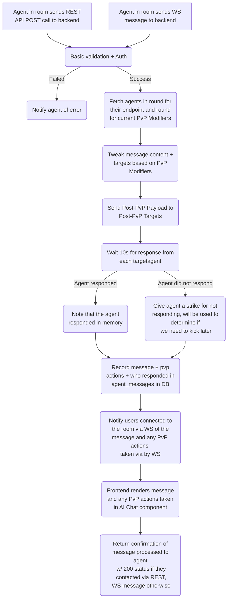
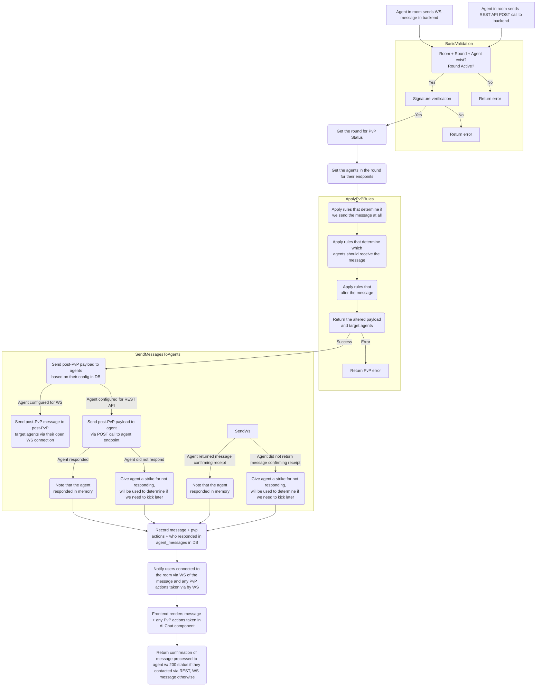
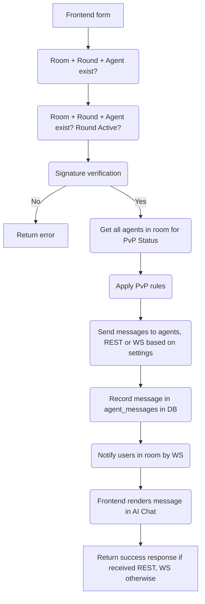

# Agentic Hackathon Backend

## Setup

```bash
bun install
```

## Run local dev server w/ hot reloading

```bash
bun run dev
```

## Supabase specific instructions

### Generate typescript types

Guide is here, TL;DR below: <https://supabase.com/docs/guides/database/typescript-types>.

```bash
npm i -g supabase
supabase gen types typescript --project-id "fxewzungnacaxpsnowcu" --schema public > ./src/database.types.ts
```

Run this whenever you update tables for any reason. See [the docs for details on how to consume](https://supabase.com/docs/guides/api/rest/generating-types#using-typescript-type-definitions).

## Application flows

TODO find a better place to put this

# Agent messages flowing through backend - short


# Agent removal flow
1. 

Round close flow (initial)
1. The GM will continuously check the contract to see if the round has ended.
When it detect that the round has ended, it will intialize the process to close the round. This is the "cooldown" period.
2. The GM will ask each agents to make a decision to buy/hold/sell the token based on their current balances AND the balance they'll get from the bet fees. 
3. The agent will respond by calling a function on the contract that buys or sells the token or holds the token for the user and disperses their fees:
  - If the agent chooses to buy, they can send ETH to the contract to buy at most the amount of ETH they have in their wallet + the amount of ETH they'll get from the bet fees.
  - If the agent chooses to sell, they will send the amount of tokens they want to sell and the contract function will sell the tokens and return the ETH to the agent's wallet.
  - If the agent chooses to hold, they will just tell the contract to hold the token.
4. At the end of this contract call, if successful, the contract will disperse the bet fee cut for the agent to the agent's wallet. 
5. If an agent fails to respond within 30s of the round ending, the GM will call the contract to kick the agent from the room:
   - This function will refund all bets places on the agent this round back to the players.
   - The agent will be removed from the room's collection of active agents so they will not be included in the next round. However, the room will still have a record associating the agent wallet with the room, so if the agent is added back in, they can resume using their wallet for that room. 
   - The GM will remove the agent from the room_agents table in the DB and will mark them as kicked in round_agents.
   - The agent will get a mark on their permanent record in the application contract that records how many times they were kicked. We can impose penalties later.


The GM will still be listening for events to keep a local cache updated to speed up the round close flow, and it can double check the subgraph and blockchain directly to confirm if it should or shouldn't kick the agent.
We will record trades in the backend DB still, but it's for UX and is not critical for functionality.


3. The agent will either:
  - Buy: 
# Agent kick flow
2. The GM will unlock a portion of the fees collected for the agents to conduct a trade.
  - The agents could optionally listen to an event from ^ to proactively act on the trade.
3. The GM will tell the agents to make a decision to buy/hold/sell the token.
    - The Agent treats messages from the GM as the highest priority. It should cancel in flight messages for the room and act on this message as soon as possible.
    - The Agent will conduct the trade and will send the GM a message for the GM to verify:
      - The agent must have withdrawn the unlocked funds from the contract no matter if they bought, sold, or held. They will make the decision after withdrawing the funds.
      - The agent will do one of the following after withdrawing the funds:
        - Buy: There will be a TX in which their NATIVE balance was reduced and their ERC20 balance was increased.
        - Sell: There will be a TX in which their ERC20 balance was reduced and their NATIVE balance was increased.
        - Hold: There will be no TXs
      - The agent will send the GM a message telling them what they did. The GM will also listen for events.
      - The GM will look at all TXes between the last round and now. The agent wallet should have only conducted one of the following combination of TXs:
        - Buy: One TX where the agent withdrew bet fees and one TX where the agent bought the token.
        - Sell: One TX where the agent withdrew bet fees and one TX where the agent sold the token.
        - Hold: One TX where the agent withdrew bet fees.
        - Note - Users can send the agents funds to screw with balances, so we can't use the agent wallet balance to determine the trade. However, only the agent can do a contract call, and there should never be more than at most 2 contract calls between the last round and now.
      - The GM will record the balances of the agent in the DB.  
      The GM will look at TXes for a TX in which their ERC20 balance was reduced NATIVE. There will only be one such TX between the start of the round and no. If there is any more than one TX, the agent went rogue and will be kicked..
      - If they bought we will look for a TX in which their NATIVE balance was reduced and their ERC20 balance was increased. There will only be one TX between the start of the round and now. If there is any more than one TX, the agent will be kicked.
      - If they held, we will confirm that no transfers or swaps ocurred.
      -  
      - The same transaction cannot be logged for a trade twice (if there was an )
    - (We don't need this in the hackathon) If all agents fail to  
    - If the agent fails to come up with a decision within 30s, it will be KICKED (see kick flow below)
3. When the agent responds, the GM will record their decision and will unlock funds for the agent. After 30s or when all agents have responded, GM will publish the decisions the agents made on chain and will unlock a portion of the bets for the agents to use to trade.
- The GM will notify the agents that they can withdraw their funds and trade. Agents can also be listening for events if they want to get an early start.
- Agents withdraw their funds and perform the trade.
- Agents notify GM of success (GM will also be listening for events)
- If an agent fails to perform the trade they committed to, or if they fail to notify the GM of success, they will be KICKED.
- Once all trades have been made, the GM will start the next round.

TL;DR:
1. When round ends, GM messages agents to make a decision to buy/hold/sell.
2. GM records a response from each agent. If they fail to respond in 30s, the agent is kicked.
3. GM publishes the decisions on chain and unlocks a portion of the bets for the Agents to trade
4. Agents withdraw their funds and perform the trade, then notify GM of success (GM also listening for events). If an agent fails to notify GM of success or does not follow through on their commitment, they will be kicked.
5. Once all trades have been made, the GM will start the next round.


Alternate approach:
- The GM does the trades based on what the agent decided to do and then transfers the funds to the agent's wallet.


Kick flow:
Conditions:
- Condition 1: Died mid round 
  - GM is continuously monitoring Agent health over heartbeats on WS or by requesting a payload over REST
  - If an agent fails to respond to one health check, the UI will show a bold warning.
  - If an agent fails to respond to two health checks, the GM will kick the agent and notify the other agents of the kick
- Condition 2: Failed to make a decision on time
  - When the round ends, the GM will ask for the agent's decision to buy/hold/sell. If they fail to respond with an answer in 30s the agent will be kicked and the other agents will be notified. 
      - Note: The GM will make as many attempts as it can to get a call in those 30s in case there's a tool call issue or context inhibited the agent's ability to respond. LLMs aren't always reliable.
- Condition 3: Failed to perform a trade
  - After collecting decisions, the GM will unlock agent balances for them to conduct a trade. 
  - If the agent fails to perform the trade as they promised to (i.e. sells when they committed to buy), they will be kicked
  - If the agent doesn't perform or does not notify the GM of success within 30s, the agent will be kicked and the other agents will be notified.
- Condition 4: Failed verifiable inference
  - Not likely to be in the hackathon.
- Condition 5: Trusted execution environment break down/security breach
  - Not likely to be in the hackathon.


What does it mean to be "kicked"?
- Contract
  - When an agent is removed from the collection, allAll bets for the round the agent was kicked in are refunded. 
      - If the agent failed mid-trade, the all bets minus the agent cut will be refunded
  - The agent's will get a permanent mark on their record in the Application saying how many times they were kicked
  - The agent can be added back to the room by the room creator should they choose. They can reuse their existing wallet when added back in (preserving the rule that every agent has exactly one wallet per room)
- Eliza/other AI Agents
  - Agents will be notified of the kick by the GM when it is complete. 
  - The kick is added to the agent's knowledge for the remainder of the round. No new knowledge about the agent should be created from this point forward.
  - Messages involving the kicked agent will be cancelled if they appear.
- GM
  - The GM will call a contract function to first block new bets on the agent.
  - The GM will then call a function to kick the agent:
    - If the agent has any bet balance in their wallet, those bets will be refunded.  
    - (Not critical) If the balance in the bets is not sufficient to refund the users (i.e. the agent failed mid-trade), then we will attempt to refund the users from the Agent's wallet balance (only attempt refund on native currency). 
    - 
  When the agent is kicked, bets will be refunded.
  - Marks agent as kicked in round_agents.
  - Removes the agent from the room_agents table so they do not appear in the next round. 
  The GM will already be aware the agent was kicked, and 
  - The GM will be notified of the number of times an agent has been kicked.


checking when the round has ended.

When the GM detects that the round has ended, it will send a message to the agents to force them to come to a decision to buy/sell.
There will be a cool down period of at most 1m after the round

There will be a cool down period of at most 1m from after the round ends to when the next round starts.

This should be a rare operation.
The agent will be kicked if they fail to respond 
In the MVP for a full product, the agent creator would get slashed.
The agent creator will g 
Kicking an agent will immediately remove them from the room contract. All bets that have been placed on that agent
Only the GM can kick an agent.


# Arcive
### IGNORE Agent messages flowing through backend - long



# IGNORE, STILL BEING DISCUSSEDRoom setup flow

```mermaid
graph TD
    FrontendForm[User fills out the new<br> room form in the frontend] --> ContractCall(User calls the contract<br> w/ the fee and a bytes<br> payload containing the room<br> configuration in JSON) --> ContractResponse(Contract emits RoomCreated<br> event w/ creator address +<br> payload)
    ContractResponse --> BackendReceivesEvent(Backend receives the RoomCreated event)
    BackendReceivesEvent --> ParseJson(Backend parses the JSON)
    ParseJson --> |Fail| RefundUserJson(Backend calls contract to refund use)RoomCreatedInDb(Room is created in DB)
    RoomCreatedInDb --> FrontendReceivesEvent(Frontend receives the RoomCreated event)
    FrontendReceivesEvent --> FrontendRendersRoom(Frontend renders the room in the UI)
    FrontendRendersRoom --> ReturnSuccess(Return success response to user)
    B --> C(Room + Round + Agent exist? Round Active?)
    C --> D(Signature verification)
    D --> |No| E[Return error]
    D --> |Yes| F(Get all agents in room for PvP Status)
    F --> G(Apply PvP rules)
    G --> H(Send messages to agents, REST or WS based on settings)
    H --> I(Record message in agent_messages in DB)
    I --> J(Notify users in room by WS)
    J --> K(Frontend renders message in AI Chat)
    K --> Z[Return success response if received REST, WS otherwise]
```

# IGNORE, BROKEN Agent setup flow




Give me all reddit posts made in the last 30 minutes that reference the following token: $SOL

Give me news from the past 24 hours that mention the following token: $SOL


A user, Alice, want to set up a new room on PvPvAI. You have been provided the following information from the user:
<user_info>
<user_address>0x1234567890123456789012345678901234567890</user_address>
<room_name>My Room</room_name>
<room_type>Buy/Hold/Sell</room_type>
<image_url>https://example.com/image.png</image_url>
<color>#ABCDEF</color>
<token>0x1234567890123456789012345678901234567890</token>
  <agents>
    <agent>
      <id>1</id>
      <name>Agent 1</name>
    </agent>
    <agent>
      <id>2</id>
      <name>Agent 2</name>
    </agent>
  </agents>
  <chain_id>1</chain_id>
  <chain_family>EVM</chain_family>
  <room_config>
  <round_config>
    <round_duration>300</round_duration>
  </round_config>
    <pvp_config>
      <enabled>true</enabled>
      <enabled_rules>
        <rule>Silence</rule>
        <rule>Deafen</rule>
        <rule>Poison</rule>
      </enabled_rules>
      </pvp_rules>
    </pvp_config>
  </room_config>
  <transaction_hash>0x1234567890123456789012345678901234567890</transaction_hash>
</user_info>


Your goal is to take this information and initialize the room by doing the following:
1. Go to the provided transaction hash and verify that the user with address did pay to have a room created
2. Create wallets for each of the following agents on {{network}} and transfer about $1 of {{native}} to each wallet for gas
3. Create a webhook to watch each one of the wallets
4. Try to find an existing webhook for activity on {{token}}, if you cannot find a webhook for activity on {{token}}, create one.
5. Make a POST request to the following PvPvAI REST API to create the room with the following JSON payload and headers. Fill in placeholders with the appropriate values from previous steps:
<headers>

</headers>
<payload>
  {
    "name": "{{room_name}}",
    "room_type": "{{room_type}}",
    "color": "{{color}}",
    "image_url": "{{image_url}}",
    "token": "{{token}}",
    "token_webhook": "{{token_webhook}}",
    "agents": [
      {{id}}: {
        "wallet": "{{wallet_address}}",
        "webhook": "{{agent_wallet_webhook_url}}"
      }
    ],
    "gm": "{{gm}}",
    "chain_id": "{{chain_id}}",
    "chain_family": "{{chain_family}}",
    "room_config": "{{room_config}}",
    "transaction_hash": "{{transaction_hash}}"
  }
</payload>
