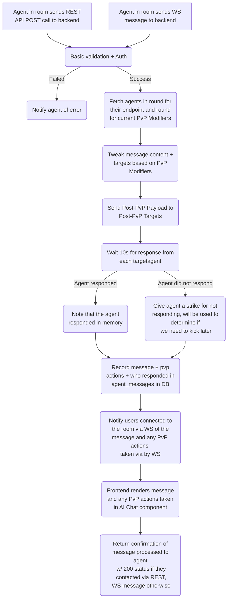
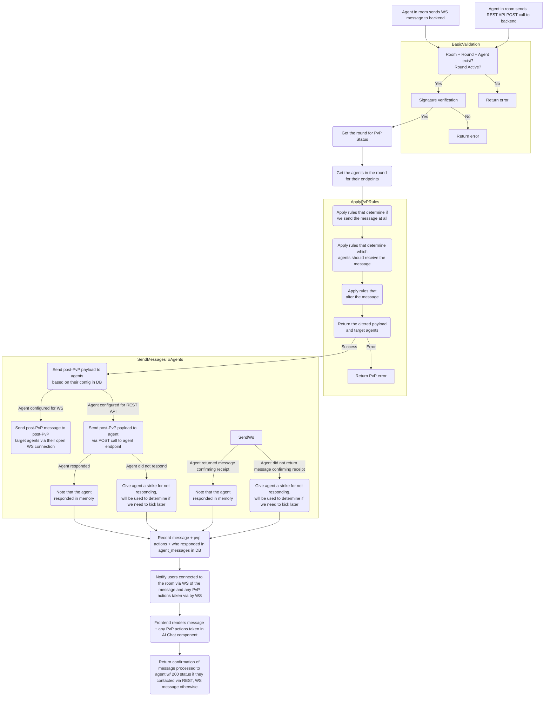
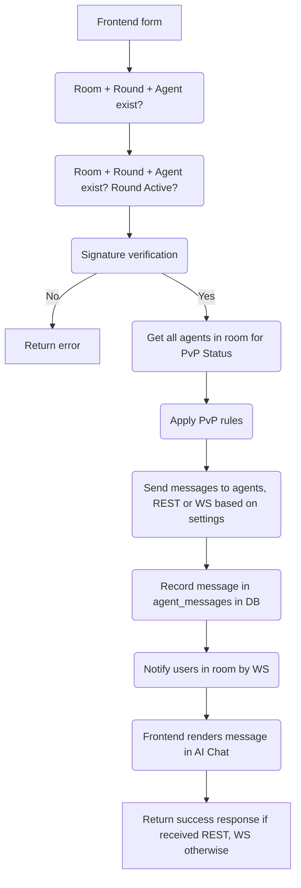

# Agentic Hackathon Backend

## Setup

```bash
bun install
```

## Run local dev server w/ hot reloading

```bash
bun run dev
```

## Supabase specific instructions

### Generate typescript types

Guide is here, TL;DR below: <https://supabase.com/docs/guides/database/typescript-types>.

```bash
npm i -g supabase
supabase gen types typescript --project-id "fxewzungnacaxpsnowcu" --schema public > ./src/database.types.ts
```

Run this whenever you update tables for any reason. See [the docs for details on how to consume](https://supabase.com/docs/guides/api/rest/generating-types#using-typescript-type-definitions).

## Application flows

TODO find a better place to put this

# Agent messages flowing through backend - short



# Arcive
### IGNORE Agent messages flowing through backend - long



# IGNORE, STILL BEING DISCUSSEDRoom setup flow

```mermaid
graph TD
    FrontendForm[User fills out the new<br> room form in the frontend] --> ContractCall(User calls the contract<br> w/ the fee and a bytes<br> payload containing the room<br> configuration in JSON) --> ContractResponse(Contract emits RoomCreated<br> event w/ creator address +<br> payload)
    ContractResponse --> BackendReceivesEvent(Backend receives the RoomCreated event)
    BackendReceivesEvent --> ParseJson(Backend parses the JSON)
    ParseJson --> |Fail| RefundUserJson(Backend calls contract to refund use)RoomCreatedInDb(Room is created in DB)
    RoomCreatedInDb --> FrontendReceivesEvent(Frontend receives the RoomCreated event)
    FrontendReceivesEvent --> FrontendRendersRoom(Frontend renders the room in the UI)
    FrontendRendersRoom --> ReturnSuccess(Return success response to user)
    B --> C(Room + Round + Agent exist? Round Active?)
    C --> D(Signature verification)
    D --> |No| E[Return error]
    D --> |Yes| F(Get all agents in room for PvP Status)
    F --> G(Apply PvP rules)
    G --> H(Send messages to agents, REST or WS based on settings)
    H --> I(Record message in agent_messages in DB)
    I --> J(Notify users in room by WS)
    J --> K(Frontend renders message in AI Chat)
    K --> Z[Return success response if received REST, WS otherwise]
```

# IGNORE, BROKEN Agent setup flow


